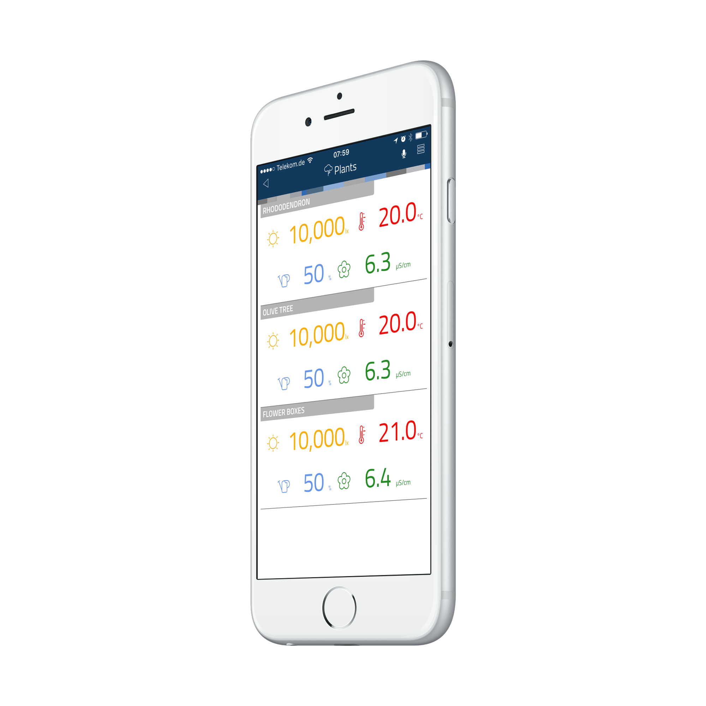

# thing-it-device-xiaomi-smart-plant-monitor

[](https://nodei.co/npm/thing-it-device-xiaomi-smart-plant-monitor/)
[](https://nodei.co/npm/thing-it-device-xiaomi-smart-plant-monitor/)

[thing-it-node] Device Plugin for the [Xiaomi Smart Plant Monitor](http://xiaomi-smart-plant-monitor.com/).

This allows you to monitor

* temperature,
* lux,
* moisture and
* fertility.

by means of [thing-it-node](https://github.com/marcgille/thing-it-node) and [thing-it.com](http://www.thing-it.com).

<p align="center"><a href="./documentation/images/plant-monitor.jpg"></a></p>

## Installation

### Hardware Setup

### Installation of NodeJS and [thing-it-node]

First, install node.js and **[thing-it-node]** on your Raspberry Pi following the instructions on the [[thing-it-node] Wiki](https://github.com/marcgille/thing-it-node/wiki/Raspberry-Pi-Installation).

### Initialization and Start of [thing-it-node] 

The **[thing-it-device-xiaomi-smart-plant-monitor]** Plugin is installed with **[thing-it-node]**, hence there is no need to install it separately.

The Plugin supports Autodiscovery for connected I2C devices, hence you only have to create a directory in which you intend to run the configuration, e.g.
 
```
mkdir ~/xiaomi-smart-plant-monitor-test
cd ~/xiaomi-smart-plant-monitor-test
```

and invoke

```
tin init
```

and then start **[thing-it-node]** via

```
tin run
```

Note, that at this point Autodiscovery would only discover distinct products such as pH meter or temperature sensor. It will not be able to distinguish between two
pH meters if you set up an I2C bus as opposed to the single device setup above.

If you don't want to use Autodiscovery, you may use configurations like the [sample configuration]("./examples.configuration") via

```
tin example --device xiaomi-smart-plant-monitor
```

If you want to pair the **[thing-it-node]** Gateway and its sample configuration with [thing-it.com](https://www.thing-it.com), invoke

```
tin pair --mesh Test
```

and enter your [thing-it.com](https://www.thing-it.com) account and password. The pairing will allow you to configure and monitor your local Gateway from 
[thing-it.com](https://www.thing-it.com) and use the Mobile App below to connect to the Gateway from everywhere.

## Mobile UI

Install the **thing-it Mobile App** from the Apple Appstore or Google Play and set it up to connect to **[thing-it-node]** 
locally as described [here](https://thing-it.com/thing-it/#/documentationPanel/mobileClient/connectionModes) or just connect your browser under 
[http://localhost:3001](http://localhost:3001) to check how the Mobile UI would look like.

The following screenshot shows the Node Page of the [sample configuration]("./examples.configuration"), which just defines 3 monitors:

<p align="center"><a href="./documentation/images/mobile-ui.png"></a></p>


## Where to go from here ...

Obviously, you may set up more complex configuration, e.g. an aquaponics solution with

* water temperature sensors,
* water level sensors,
* switches for pumps, feeders, shades and fans, 
* cameras to watch the fish ponds remotely etc.

Or, you want to distribute a set of sensors and correlate their historical data with wheather data and other things on [thing-it.com](https://www.thing-it.com).

You may also be interested in

* Configuring additional [Devices](https://www.thing-it.com/thing-it/#/documentationPanel/mobileClient/deviceConfiguration), 
[Groups](https://www.thing-it.com/thing-it/#/documentationPanel/mobileClient/groupConfiguration), 
[Services](https://www.thing-it.com/thing-it/#/documentationPanel/mobileClient/serviceConfiguration), 
[Event Processing](https://www.thing-it.com/thing-it/#/documentationPanel/mobileClient/eventConfiguration), 
[Storyboards](https://www.thing-it.com/thing-it/#/documentationPanel/mobileClient/storyboard    Configuration) and 
[Jobs](https://www.thing-it.com/thing-it/#/documentationPanel/mobileClient/jobConfiguration) via your **[thing-it] Mobile App**.
* Use [thing-it.com](https://www.thing-it.com) to safely connect your Node Box from everywhere, manage complex configurations, store and analyze historical data 
and offer your configurations to others on the **[thing-it] Mesh Market**.
* Explore other Device Plugins like [Texas Instruments Sensor Tag](https://www.npmjs.com/package/thing-it-device-ti-sensortag), [Plugwise Smart Switches](https://www.npmjs.com/package/thing-it-device-plugwise) and many more. For a full set of 
Device Plugins search for **thing-it-device** on [npm](https://www.npmjs.com/). 
* Or [write your own Plugins](https://github.com/marcgille/thing-it-node/wiki/Plugin-Development-Concepts).
